<h3 align="center">Hi, I'm Abolfazl Nazerpanah &nbsp; </h3> 

 
I worked for 3 years professionally as a site designer and back-end developer using the Python language and Django framework. also used Celery and Django Rest Framework.
 
I am interested in writing optimized and clean code, as well as the world of open source and Linux.
 
 

 
 

